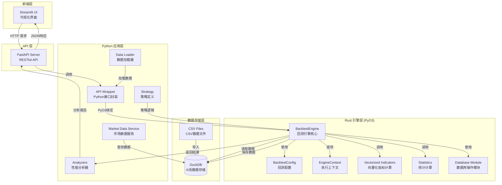
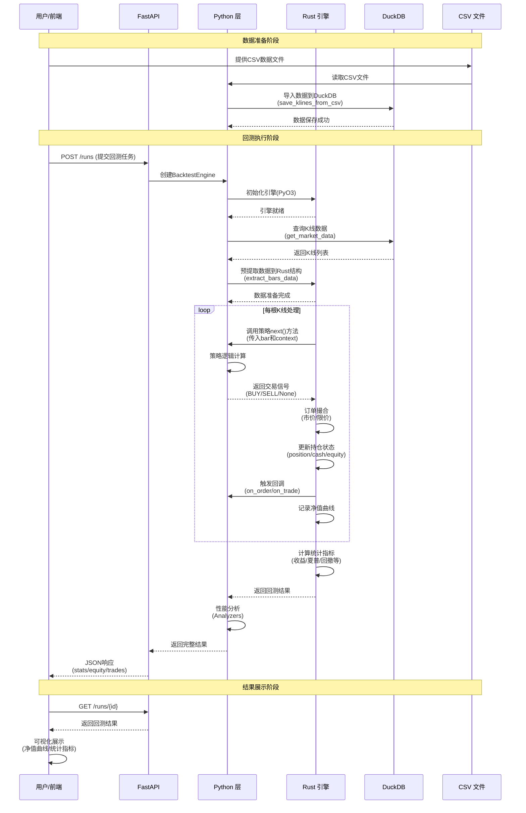

# pyrust-bt

混合语言回测框架：Python 负责策略与数据，Rust 负责高性能回测核心，通过 PyO3 绑定无缝衔接。兼顾研发效率与执行性能，适合从研究到小团队生产落地。

[English README](README.en.md)

## 功能概览

-   核心引擎（Rust）

    -   时间推进：按 bar/tick 顺序执行
    -   订单撮合：市价 / 限价（同 bar 简化成交）
    -   成本模型：手续费 `commission_rate`、滑点 `slippage_bps`
    -   仓位与账本：`position / avg_cost / cash / equity / realized_pnl`
    -   指标计算：向量化 `SMA / RSI`（滑动窗口优化）
    -   统计指标：总收益、年化、波动率、夏普、Calmar、最大回撤与持续时间
    -   性能优化：批处理（可配 `batch_size`）、预提取数据、预分配容器、内联热点函数

-   Python API

    -   策略模型：`on_start` → `next(bar)` → `on_stop`，支持事件回调 `on_order / on_trade`
    -   下单动作：
        -   字符串：`"BUY" | "SELL"`
        -   字典：`{"action": "BUY"|"SELL", "type": "market"|"limit", "size": float, "price"?: float}`
    -   数据加载：CSV → list[dict]（MVP，可替换为 Parquet/Arrow）
    -   分析器：回撤段落、回合交易、增强性能指标、因子回测（分位/IC/单调性）、综合报告
    -   参数优化：朴素网格搜索（可自定义评分指标）

-   前后端
    -   API（FastAPI）：`POST /runs`、`GET /runs`、`GET /runs/{id}`
    -   前端（Streamlit）：提交任务、任务列表、净值曲线与统计展示

## 安装与构建

前置：Python 3.8+、Rust（`rustup`）、maturin

```powershell
pip install maturin
cd rust/engine_rust
maturin develop --release

pip install maturin
cd rust/engine_rust

# Option A: Install directly into the active Python environment (best for local dev)
maturin develop --release

# Option B: Build wheel only, install manually afterwards
python -m maturin build --release
pip install --force-reinstall (Get-ChildItem target/wheels/engine_rust-*.whl | Select-Object -First 1).FullName
```

## 快速开始

-   基础回测

    ```powershell
    cd ../..
    python examples/run_mvp.py
    ```

-   分析器示例

    ```powershell
    python examples/run_analyzers.py
    ```

-   网格搜索示例

    ```powershell
    python examples/run_grid_search.py
    ```

-   性能测试与批处理对比

    ```powershell
    python examples/run_performance_test.py
    ```

示例数据：`examples/data/sample.csv`（列：`datetime,open,high,low,close,volume`）。

### 免维护 QMT / XtData 自动补数

-   若本地数据库缺少区间数据，`MarketDataService` 会调用 QMT Mini（xtdata）下载补齐后写回 DuckDB，实现“先查库 → 缺口自动补齐”的流程。
-   准备步骤：
    1. 下载 xquant 拷贝带 D:\ProgramData\miniconda3\Lib\site-packages（修改成自己的 python 路径） 。
    2. 确保能在 Python 中 `import XtQuant.XtData`。
    3. 设置环境变量 `XTDATA_DIR` 指向 MiniQmt 的 `userdata_mini` 目录（示例默认使用 `D:\国金证券QMT交易端\userdata_mini`）。
-   运行多资产等权示例验证数据链路：

    ```powershell
    python examples/run_multi_asset_rebalance_strategy.py
    ```

-   更多设计细节与补数流程，可参考 `docs/xtdata_market_data_plan.md`。

## 代码用法

-   配置与引擎

    ```python
    from pyrust_bt.api import BacktestEngine, BacktestConfig
    cfg = BacktestConfig(start="2020-01-01", end="2020-12-31", cash=100000,
                         commission_rate=0.0005, slippage_bps=2.0, batch_size=1000)
    engine = BacktestEngine(cfg)
    ```

-   策略（最小实现）

    ```python
    from pyrust_bt.strategy import Strategy
    class MyStrategy(Strategy):
        def next(self, bar):
            if bar["close"] > 100:
                return {"action": "BUY", "type": "market", "size": 1.0}
            return None
    ```

-   运行回测

    ```python
    from pyrust_bt.data import load_csv_to_bars
    bars = load_csv_to_bars("examples/data/sample.csv", symbol="SAMPLE")
    result = engine.run(MyStrategy(), bars)
    print(result["stats"], result["equity"])  # 统计与净值
    ```

## 分析与报告

-   回撤段落：`compute_drawdown_segments(equity_curve)`
-   回合交易：`round_trips_from_trades(trades, bars)` / 导出 CSV
-   性能指标：`compute_performance_metrics(equity_curve)`（Sharpe/Sortino/Calmar/VAR）
-   因子回测：`factor_backtest(bars, factor_key, quantiles, forward)`
-   综合报告：`generate_analysis_report(...)`

## API 与前端

-   启动 API（FastAPI）

    ```powershell
    pip install fastapi uvicorn pydantic requests streamlit
    python -m uvicorn python.server_main:app --reload
    ```

-   启动前端（Streamlit）

    ```powershell
    set PYRUST_BT_API=http://127.0.0.1:8000
    streamlit run frontend/streamlit_app.py
    ```

## 性能提示

-   使用较大的 `batch_size`（如 1000~5000）减少 Python 往返
-   优先使用结构化动作（dict）
-   指标尽量采用 Rust 向量化函数（`compute_sma/compute_rsi`）
-   大数据优先 Parquet/Arrow，按 symbol/time 分区读取

## 🚀 性能优化成果

-   回测速度：1,682 bars/s → **419,552 bars/s**（≈ 250×）
-   数据规模：55 万根 bar ~1.3 秒
-   内存：预分配容器，降低重分配
-   批处理：可配 `batch_size` 减少 GIL 争用

## 系统架构

### 架构概览

以下图表展示了 pyrust-bt 的整体架构：



### 数据流程

以下图表展示了从数据输入到结果输出的完整数据流程：



### 核心组件说明

-   **前端层**：基于 Streamlit 的 Web 界面，用于提交回测任务和可视化结果
-   **API 层**：FastAPI RESTful API，用于管理回测任务
-   **Python 层**：策略定义、数据加载、分析工具和 API 封装
-   **Rust 引擎**：高性能核心引擎，通过 PyO3 绑定实现订单撮合、持仓管理和统计计算
-   **数据存储**：DuckDB 用于高效的 K 线数据存储和查询

### 性能优化要点

1. **数据预提取**：所有 bar 数据预先提取到 Rust 结构，减少 Python↔Rust 往返
2. **批量处理**：可配置 `batch_size` 减少调用 Python 策略时的 GIL 争用
3. **向量化操作**：使用滑动窗口算法优化的指标计算
4. **直接数据库访问**：Rust 函数直接查询 DuckDB，绕过 Python 开销
5. **临时表策略**：使用临时表实现超高速批量插入的数据持久化

## 目录结构

-   `rust/engine_rust`：Rust 引擎（PyO3），含指标与统计
-   `python/pyrust_bt`：Python API/策略/数据/分析器/优化器
-   `examples`：MVP、分析器、网格搜索、性能测试
-   `frontend`：Streamlit 页面

## TODO / Roadmap

-   引擎/撮合：部分成交、挂单簿、止损/止盈、OCO、条件单；多资产/多周期；流动性与冲击模型
-   数据：Parquet/Arrow 零拷贝管道、列式批处理；DataFeed 抽象与缓存
-   分析/报告：分组统计、回撤可视化、交易分布；报告导出（PDF/HTML）、多回测对比
-   优化/并行：随机/贝叶斯搜索、交叉验证；多进程/分布式（Ray/Celery/k8s Jobs）
-   前端/可视化：React + ECharts/Plotly；WebSocket 实时日志/进度/曲线
-   工程质量：单元/集成/回归测试、基准；CI 构建发布

## 交流学习

欢迎提交 PR！


## 许可

MIT

## 免责声明

本工具的任何分析仅供研究与学习参考，不构成任何投资建议。用户应对自己的交易决策与风险负责。
